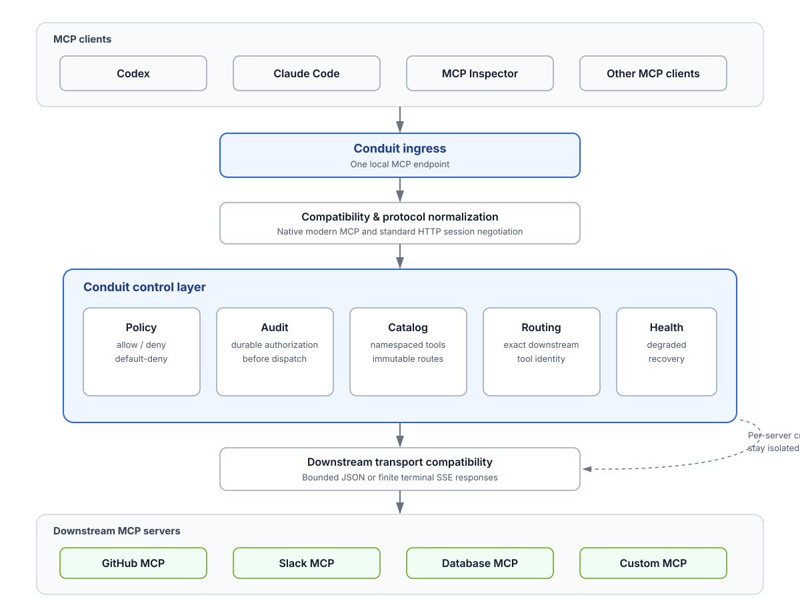

# Conduit architecture

Conduit implements a narrow federation path. Clients connect to Conduit rather
than directly to each downstream. Protocol normalization, policy, durable
authorization audit, catalog publication, exact routing, and health controls
remain in the local control layer; each downstream receives only its
configured credentials and a bounded transport request.

Ingress accepts MCP 2026-07-28 on the local Streamable HTTP endpoint. It serves `server/discover`, the published aggregate for `tools/list`, and hands `tools/call` to the dispatcher. It does not forward the client request as a general proxy request.

## Discovery and aggregate publication

Each refresh uses a configured downstream’s Streamable HTTP endpoint for `server/discover` and `tools/list`. Catalogs are bounded by the configured page, tool, and byte limits. A successful catalog is published into an immutable aggregate generation. A failed refresh removes that downstream’s previous catalog; a later successful refresh recovers it.

Aggregate tool names are deterministic: `<downstream-id>.<downstream-tool-name>`. Each published name has an exact `Route` containing the configured downstream identity and original tool name. Calls therefore use the stored mapping; names are never split to infer a route. Publication is deterministic, policy-filtered, and rejects collisions or aggregate limits instead of exposing a partial aggregate.

## Policy and authorization

Policy allow/deny rules filter public `tools/list` output. For a call, the registry prepares the route, then authorization is committed while verifying that the same aggregate generation and policy still apply. The durable authorization audit record is written inside that linearization boundary. If it cannot be written, no downstream transport starts. Authorization requires a complete write, flush, and `fsync` of the configured private audit file. A short write, serialization/flush/fsync error, replaced or removed pathname, or weakened file permissions makes audit unavailable and blocks future calls rather than risking an unaudited side effect. Recovery from that fail-closed state is by restoring the destination and restarting Conduit.

The registry lock is released before network I/O. This makes refresh publication independent of downstream execution while preventing a stale prepared route from being authorized.

## Dispatch and outcomes

The dispatcher is the only production owner of downstream `tools/call`. It sends one request to the exact configured endpoint, with the original downstream tool name and downstream-owned configured headers. It does not perform discovery, initialization, redirects, or automatic retries for a call.

Terminal JSON results and correlated JSON-RPC errors are relayed with the original client request ID. Response bodies are bounded before parsing. If transport has started and the final state is not safely known—for example a timeout, malformed or oversized response, or unsupported SSE/progress response—the result is recorded and returned as uncertain-after-dispatch. Conduit does not retry such a call.

When a downstream response creates a Streamable HTTP session, Conduit records only that invocation’s returned session ID and performs at most one bounded cleanup `DELETE` against the same endpoint. Cleanup uses the invocation/shutdown context and cannot replace a valid tool result. Stateless calls have no cleanup request.

## Lifecycle and readiness

The health state records liveness, audit availability, downstream refresh state, and the currently published aggregate generation. Conduit is ready only after every configured downstream has attempted initial refresh, at least one is healthy, the aggregate is usable, and audit storage is available.

On shutdown, Conduit stops dispatch admission and HTTP acceptance, cancels active dispatch contexts, waits for their terminal audit paths, and only then closes audit storage. Refresh processing is cancelled and joined as part of the same shutdown sequence.
